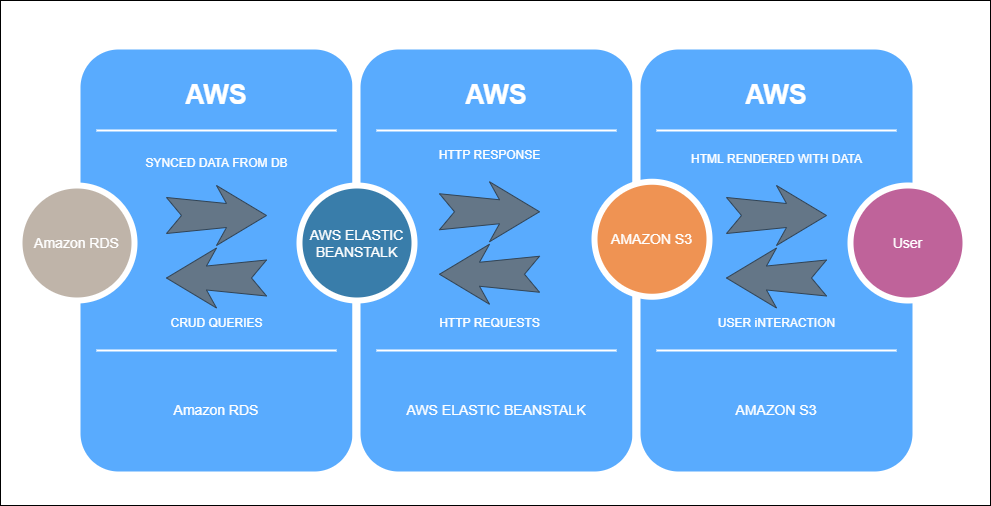

# Infrastructure

## AWS services 

### Elastic Beanstalk (EB)

- Provide the Backend Hosting service 

### S3

- Provide the Frontend hosting service
- saves uploaded images

### RDS

- provide PostgreSQL database with public access 

## Infrastructure Diagram

 
